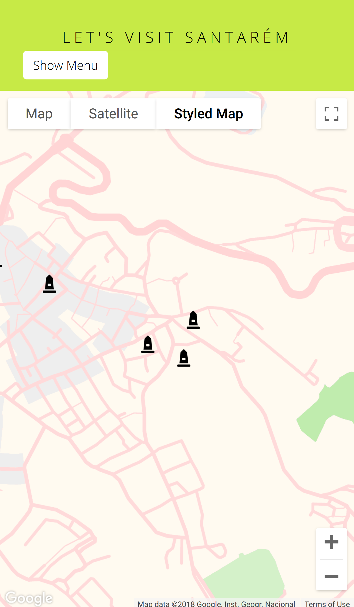

# Let's Visit Santarém App Project

## What is Let's Visit Santarém App Project

Let's Visit Santarém App Project is the final project of the Udacity and Google's Front-End Web Developer NanoDegree. Using React and Google Maps API to teach the
student the skill required for real-world projects.

### Screenshot

### Live Website

- Clone the repository
- Open your favourite command shell and `cd` into the folder
- Run the server using the following command:
    - `npm install` (this command will install all dependencies)
    - `npm start`

### External libraries Used

* Google Maps API
* Reactjs
